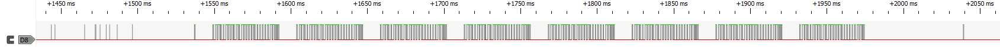
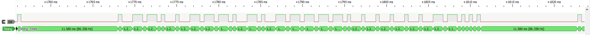
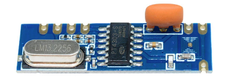

# OrigoSmokeDetector

A header-only C++ library, plus gateways, for Housegard Origo smoke detectors

## Introduction

The Housegard Origo smoke detectors are interconnected using 433MHz radio communication. If one of them starts an alarm, all the others will sound as well.
These smoke detectors are interconnected but do not have an app or any connectivity to other systems.

These detectors have a more solid interconnection than many others because they are not relying on the presence of a hub/gateway to trigger each other.

This repo implements a library for creating a gateway for these smoke detectors, so that other systems can be notified if an alarm goes off, and also see which detector was triggered.

It contains a few gateways for different protocols, most notably MQTT, but can also be used as a simple libary so you can make yur own program to interface with other systems.

## How

The gateway will pick up the radio transmissions from the smoke detectors, extract the device ID, and send a notification to other systems.

The signals were logged with a Cyprus Datalogger board connected to a SRX882 433MHz receiver, using PulseView. Having found the pulse widths and sequence lengths, this library could be written.

This is what the sequences look like. All 8 sequences are identical.

Zooming in to one sequence, we see the two widths that can be interpreded as 0 (short) and 1 (long). The first 8 bits are the smoke detector ID.

The examples can do a SCAN to identify your detectors' bit sequences and detector IDs and print them to the Arduino serial monitor. You should then type these bit sequences into the UserValues.h file before flashing your device again. Uncomment the #define DEBUG_PRINT and DEBUG_PRINT_SIGNAL in UserValues.h to enable scan and printout. Simply push the test button on a smoke detector to send the signal to be detected. Press it just long enough for it to sound but not trigger all the other interconnected detectors if you have more than one.

## Hardware

Total hardware cost can be as low as 3-4€ in total for both a receiver and a microcontroller board.

The sketch should run on any device that can be programmed from the Arduino sketches in this repo.

It needs a 433 MHz receiver like the cheap SRX882 (search on eBay). Avoid the even cheaper green ones.

It is tested in two contexts:

1. On an ESP8266 with a SRX882, using a direct connection to a MQTT broker via WiFi.

2. On an Arduino Nano with a SRX882, communicating on a single-wire bus using no extra hardware. This is based on the ModuleInterface repo that is utilizing PJON on the SWBB strategy.

### MQTT gateway

This gateway sketch can be found in [examples/OrigoMqtt](examples/OrigoMqtt), and has been tested on a ESP8266. It is probably able to run on most other WiFi capable Arduino compatible boards as well.

When an alarm is detected, the gateway will publish a message to the MQTT topic origo/alarm/<numeric device ID> with the epoch time as payload. Using the timestamp of the alarm makes it easy to determine when each smoke detector was last triggered when looking at the topics in the MQTT broker.
  
Systems like Home Assistant can pick up the MQTT notifications and trigger automations like flashing lights or voice information about which detector has triggered, plus notifications to mobile devices. The imagination is the limit. See the gateway example README for a Home Assistant configuration example.

### ModuleInterface gateway

This gateway sketch can be found in [examples/OrigoModuleInterface](examples/OrigoModuleInterface) and has been tested on an Arduino Nano. It is meant to be part of a ModuleInterface wired bus network (daisy-chained/star/any topology) using only a digital Arduino pin (no communication shields required on the device itself).
The ModuleInterface Master will pick up alarm events and will forward them to other modules that are listening, plus to its own web pages+database and potentially also to a MQTT broker.

## Dependencies

* The library itself does not depend on any other repositories. This means you can easily use it to create gateways to other protocols than the ones that are available here.
* The MQTT gateway depends on [ReconnectingMqttClient](https://github.com/fredilarsen/ReconnectingMqttClient), [PJON](https://github.com/gioblu/PJON) and [NTPClient](https://github.com/arduino-libraries/NTPClient).
* The ModuleInterface gateway depends on [ModuleInterface](https://github.com/fredilarsen/ModuleInterface) and [PJON](https://github.com/gioblu/PJON) repository.
