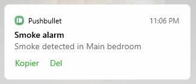

# OrigoMqtt example

This is a MQTT gateway to be run on a ESP8266 or other WiFi-enabled device.

Connect the DATA pin of the radio to pin D5 of the device (or change to another pin in UserValues.h).

The device used for testing is the Wemos D1 mini.

## Performing a SCAN to recognize your smoke detectors

Define DEBUG_PRINT and DEBUG_PRINT_SIGNAL in UserValues.h to have the device print detected signals to Serial.

Result from a SCAN is shown below.
This is by having output from the device shown in the Serial Monitor in the Arduino IDE, while pressing the test button on a smoke detector long enough for it to produce one beep.

The detector sends 8 sequences each time. In this case 4 of them have been caught. 
The reason why all 8 are not caught is because the device is busy publishing to the MQTT broker immediately after it has received one sequence, so it may miss the next repetition.

    .......
    DHCP assigned IP is 10.0.0.234
    
    Sequence: 010101100110010110100110100101010101010101011010000
    Widths: 473 1236 468 1236 469 1244 1216 484 460 1249 1210 489 455 1249 460 1253 1210 494 1204 494 450 1258 1205 498 1200 503 441 1262 445 1258 450 1257 450 1253 455 1252 455 1252 455 1271 460 1237 459 1247 1209 483 1209 469 449 451 449 
    HIGHBITS = 0x5AAA
    LOWBITS  = 0xA965A600
    DEVICEID = 0x6A (106)
    ALARM from ID=106, count = 1
    
    Sequence: 010101100110010110100110100101010101010101011010000
    Widths: 470 1241 469 1237 468 1242 1222 483 460 1251 1212 488 454 1256 455 1255 1211 494 1207 497 445 1264 1202 503 1202 497 445 1264 445 1259 449 1255 454 1253 455 1253 456 1253 455 1273 460 1239 460 1243 1210 484 1209 470 450 450 451 
    HIGHBITS = 0x5AAA
    LOWBITS  = 0xA965A600
    DEVICEID = 0x6A (106)
    
    Sequence: 010101100110010110100110100101010101010101011010000
    Widths: 469 1238 470 1238 469 1243 1218 485 459 1252 1219 488 455 1252 455 1257 1208 498 1204 498 450 1261 1203 503 1198 503 440 1266 449 1257 449 1261 450 1256 454 1251 459 1250 455 1275 459 1241 459 1241 1212 488 1206 474 449 450 449 
    HIGHBITS = 0x5AAA
    LOWBITS  = 0xA965A600
    DEVICEID = 0x6A (106)
    
    Sequence: 010101100110010110100110100101010101010101011010000
    Widths: 473 1235 474 1240 468 1245 1219 484 461 1253 1215 489 455 1253 456 1253 1214 494 1205 498 446 1267 1205 498 1205 498 445 1263 450 1257 450 1258 454 1258 454 1252 456 1251 460 1272 459 1242 460 1247 1213 484 1208 474 449 450 450 
    HIGHBITS = 0x5AAA
    LOWBITS  = 0xA965A600
    DEVICEID = 0x6A (106)
    ALARM from ID=106, count = 3

Copy the HIGHBITS and LOWBITS values from the printout to your UserValues.h for the device to recognize your devices.

Flash the device and repeat the test. You should see the "ALARM from ID=" print showing that it recognizes your detector.

You can then comment out the define of DEBUG_PRINT_SIGNAL but leave DEBUG_PRINT. When you reflash and retest, you should only see the "ALARM from" printout showing the device ID.

At this point you can repeat for all your smoke detectors to get their ID number printed, so you know what number is associated with each device. Or you could simply inspect the alarms being reported in your MQTT broker instead of looking in the serial monitor.

A note about the HIGHBITS and LOWBITS: These are determined by the master smoke detector and programmed into the slaves in the pairing phase. If you reset the master, it will make a new bit sequence, and all the other detectors must be reset and re-paired. If the sequence is changed, you will have to do a new SCAN and use the new HIGHBITS and LOWBITS.
Although the Origo smoke detectors need one device to be master, this is only for the pairing, to have the bit sequence and device ids assigned and distributed. When an alarm goes off, the interconnection is not depending on the master being available.

The gateway recognizes the sequences and extracts the detector id. So why have the HIGHBITS and LOWBITS programmed into the gateway at all?
- For better filtering of noise and unknown signals, avoiding false alarms
- To avoid picking up alarms from your neighbor's identical smoke detectors with another bit sequence

## MQTT topics

Alarms will be published to the topic origo/alarm/<smokedetector_id>, where smokedetector_id is in the range 1-255 and the payload will be the current epoch time in seconds, like 1682546046. Using Epoch time is the universal way to exchange timestamps without problems.

The gateway will also publish:
* Startup time to origo/startup, with epoch time as payload
* A heartbeat to origo/heartbeat every 10 seconds, with epoch time as payload

You can specify the NTP server used to do the time synchronization, in UserValues.h. For example, you can use your own router if the device is put on a closed network. If an NTP server is not available, the payload will be the number of seconds since startup of the device.

## Onboard LED

The LED will flash slowly to show that the gateway is alive and listening.

When an alarm has been received, the LED will flash very quickly to show this, and the rapid flashing continues until 10 seconds after the last alarm sequence was received.

## Antenna

Using the standard short cobber coil antenna of the SRX882 should work in most homes.

Test with the smoke detector that is placed farthest away or behind the thickest walls. If the alarm is not picked up, you need to improve the antenna.

Adding a bigger ground plane can improve the reception. If you do have space for it, adding a 17.3 cm straight wire antenna can be efficient. Or even two 17.3 cm wires in opposite directions -- the SRX882 has holes for two antennas. Single-stranded wires are best, and it is said that enameled copper wires are better than plastic insulated wires, though I have no tests confirming this. I use plastic insulated wires and have great coverage, also from a separate garage.
Further antenna recommendations are welcome, please contribute.

One note on the newer variant SRX882S is that it seems you have to connect CS for it to activate. This is not needed on the SRX882.

## Home Assistant configuration for picking up alarms

If you use Home Assistant for picking up the alarms, this is an example of a configuration snippet that could do the job. Put it in your automations.yaml and modify.

    - alias: Smoke alarm
      trigger:
        platform: mqtt
        topic: origo/alarm/+
      condition:
        condition: template
        value_template:
          "{{ (as_timestamp(now())|int > trigger.payload|int - 120) and
          as_timestamp(now())|int < trigger.payload|int + 120 }}"
      action:
        - service: notify.pushbullet
          data:
            title: Smoke alarm
            target: device/Galaxy S21 Ultra
            message: >
              
              
              Smoke detected in {{ mapper[id] if id in mapper else '(unknown)' }}

It is mapping the smoke detector IDs to room names, and then sending a notification to a phone, in this case using PushBullet. 
The condition is not strictly required, and can be removed. It is simply making doing a time filtering of the messages to make sure only valid and fresh messages can trigger the notifications, assuming the ESP and the HA server both being time synchronized within a big margin.

A phone notification:

Add more actions as needed.
